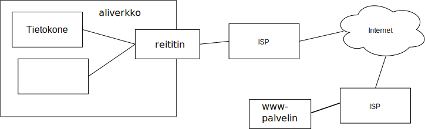

<text-box variant='learningObjectives' name='Oppimistavoitteet'>

- Osaat kuvata aiempien osien materiaalin yhteistoiminnan.

</text-box>

Tässä osassa käydään läpi yksi kokoava esimerkki, jossa käydään erityisesti läpi, miten kurssin kuluessa käsitellyt menetelmät toimivat yhdessä. Kun käyt tätä läpi, niin kertaa samalla kaikkien protokollien yksityiskohdat.

Käydään esimerkkinä läpi tilanne, jossa käyttäjä liittää oman koneensa aliverkkoon langallisella yhteydellä ja tekee sen jälkeen www-selaimella pyynnön lukea joku tietty sivu.  Tämä aliverkko voi olla kotiverkko tai esimerkiksi jonkun yrityksen hallinnoima oma sisäinen verkko.

Tämä esimerkki tiivistää suurimman osan kurssin sisällöstä yhteen tarinaan. Jotkut protokollat jäävät vielä pois tarinasta ja osasta ei tarvita kaikkia yksityiskohtia, mutta suurin osa kurssisisällöstä tulee kerrattua tällä hyvin yksinkertaisella tarinalla.

 </img>

## Verkkoon liittyminen

Verkkoon liitetty tietokone ei voi liikennöidä verkossa, jos sillä ei ole verkkoon sopivia tunnisteita, joilla muut voivat lähettää sille viestejä.

<quiz id="a69e0cef-84ae-4ad8-8c28-dc408c892e72"> </quiz>

Jotta sovelluskerroksella muodostetty pyyntö voidaan välittää verkkoon, niin sen pitää edetä protokollapinossa kerrokselta toiselle. Jätetään tuo kerrosten tarkastelu hetkiseksi ja mennään eteenpäin. Muista kuitenkin, että kaikki lähetetyt ja vastaanotetut viestit kulkevat aina protokollapinossa kerrokselta toiselle.

Kun tietokone on liittynyt verkkoon, se on valmiina lähettämään ja vastaanottamaan viestejä.

Seuraavaksi käyttäjä käynnistää www-selaimen ja kirjoittaa osoitekenttään sen www-palvelimen nimen, jonka pääsivun käyttäjä haluaa hakea. Oletamme tässä, että kyseisen palvelimen nimi on www.verkkotunnus.fi   (Tämä osoite vie itseasiassa Traficomin sivulle, joten tunnus on aidosti olemassa.)

Selain siis lähtee seuraavaksi hakemaan kyseistä www-sivua.

## Kyselyn alussa tietojen selvittäminen

Selaimen pitää muodostaa HTTP-pyyntö, mutta ennen kuin se saa pyynnön valmiiksi lähetystä varten, sen täytyy selvittää kyseistä verkkonimeä www.verkkotunnus.fi vastaava IP-osoite.

Niinpä selain tekee pyynnön nimipalvelijalle, jonka osoitteen se on jo saanut aiemmin. Sovelluskerrokselta nimipalvelukysely siirtyy kuljetuskerrokselle. Nimipalvelupyyntö käyttää UDP:tä kuljetuskerroksen protokollana, joten erillistä yhteydenmuodostusta ei tehdä.  Kuljetuskerros muodostaa pyynnöstä segementin ja antaa sen edelleen verkkokerrokselle välitettäväksi eteenpäin.
Verkkokerros paketoi segmentin omaan IP-datagrammiinsa ja antaa datagrammin linkkikerrokselle.

Verkkokerroksen datagrammissa on vastaanottajan IP-osoite. Koska vastaanottaja ei ole samassa aliverkossa täytyy verkkokerroksen ohjata viesti reititystaulun mukaisesti oletusyhdyskäytävälle. Oletusyhdyskäytävän IP-osoitteen laite on saanut verkkoon liittyessän. Näin ollen verkkokerros tietää sen, mutta linkkikerros tarvitsee IP-osoitetta vastaavan MAC-osoitteen. Joten ennenkuin verkkokerroksen datagrammi / IP-paketti voidaan sijoittaa linkkikerroksen kehykseen täytyy tuo MAC-osoite selvittää. IP-osoitteen perusteella MAC-osoitteen selvittävä protokolla määritellään välillä verkkokerrokselle ja välillä linkkikerrokselle kuuluvaksi.

<quiz id="a50903df-836c-422d-95ae-da29218e3448">  </quiz>

Nyt meillä on tarvittavat tiedot siihen, että linkkikerros voi sijoittaa saamansa IP-datagrammin Ethernet-kehykseen ja lähettää sen paikalliselle yhdyskäytäväreitittimelle.

Muistathan vielä, että kehyksen sisällä olevan datagrammin sisällä olevassa UDP-segmentissä on paikalliselle nimipalvelijalle menossa oleva kysely.

Nyt asiakaskone lähettää kehyksen verkkoon, josta se päätyy vastaanottajan MAC-osoitteen perusteella yhdyskäytäväreitittimelle.

Yhdyskäytäväreititin vastaanottaa verkkokerroksella sille linkkikerroksen kautta ohjatun nimipalvelukysely. Se tarkistaa datagrammista, mikä on vastaanottajan IP-osoite eli minne viesti on menossa ja välittää sen reititystaulunsa tietojen perusteella eteenpäin. Näin viesti liikkuu reitittimeltä toiselle, kunnes se saapuu nimipalvelijan kanssa samassa aliverkossa olevalle reitittimelle. Tämä reititin ohjaa viestin nimipalvelijalle.

Nimipalvelijalla linkkikerros vastaanottaa tälle laitteelle (=kehyksen vastaanottana on laitteen MAC-osoite) tulossa olevan viestin ja antaa sen verkkokerrokselle. Verkkokerros tarkistaa, että viesti on nyt perillä oikealla laitteella, eli että vastaanotetussa datagrammissa on vastaanottajana tämän laitteen IP-osoite. Verkkokerros antaa viestin kuljetuskerroksen UDP-protokollalle, joka segmentin porttinumeron perusteella osaa antaa viestin edelleen nimipalveluprosessille.

<quiz id="abb2ab02-88ba-465d-9d3b-e2f7d709d64b"> </quiz>

Nimipalveluprosessi selvittää ensin omasta välimuististaan tietääkö se jo valmiiksi vastauksen saamaansa kyselyyn.  Jos pyydettyä tietoa ei ole sen omassa välimuistissa, niin se lähtee kysymään tietoa virallisten nimipalvelijoiden hierarkialta. Ja saatuaan vastauksen lisää sen omaan välimuistiinsa. Oletetaan tässä yksinkertaisuuden vuoksi, että tieto löytyy suoraan välimuistista.

Nimipalvelija muodostaa niin nimipalveluprotokollan mukaisen viestin ja sijoittaa viestin vastauskentään tarvittavat nimipalvelutietueet. Sen jälkeen sovelluskerros antaa nimipaveluviestin kuljetuskerrokselle, jossa se sijoitetaan UDP-segmentin sisään ja annetaan verkkokerrokselle. Koska kyseessä on vastaus aiempaan viestiin, niin lähettäjällä (=tämä paikallinen nimipalvelija) on jo tiedossaan vastaanottajan (=alkuperäinen kysyjä) IP-osoite ja porttinumero. Ne tulivat kyselyn mukana otsakekentissä. Nyt lähettäjän ja vastaanottajan porttinumerot sijoitetan UDP-segmentin otsakkeeseen, jonka verkkokerros sijoittaa omaan IP-datagrammiinsa. Datagramissa on vastaavasti lähettäjän (=tämä nimipavelija) ja vastaanottajan (=alkuperäinen kysyjä) IP-osoitteet. Datagrammi etenee sitten seuraavaksi linkkikerrokselle, joka sijoittaa sen omaan kehykseensä. Linkkikerroksella tämän kehyksen vastaanottajana on nimipalvelijan aliverkon reitittimen MAC-osoite.

Ja näin vastaus viesti pääsee liikkelle ja etenee kuten kaikki muutkin viesti reititin kerrallaan vastaanottajalle, jossa taas protokollapinoa pitkin sovelluskerroksen nimipalvelukirjastolle ja sitä kautta tieto päätyy selaimelle.

## Itse kysely

Nyt selaimella on vihdoin tarvittavat tiedot, jotta se voi viimeistellä HTTP-pyynnön. Se tietää nyt mille laitteelle kysely pitää kohdistaa. Selain voi siis avata pistokkeen ja avamisen jälkeen sijoittaa pyynnön tähän pistokkeeseen, josta kuljetuskerros saa sen välitettäväksi eteenpäin.

Koska HTTP-protokolla käyttää TCP:tä kuljetuskerroksen palveluna, avaa TCP yhteyden vastaanottajaan jo pistokkeen luonnin yhteydessä. Siinä vaiheessa tehdään TCP:n SYN-ACK -kättely ja avataan yhteys, jota pitkin sitten myöhemmin sovelluskerroksen viestit voivat kulkea molempiin suuntiin. Asiakas siis aloittaa kättelyn siinä vaiheessa, kun selain suorittaa pistokkeen avaamiseen liittyvän kirjastofunktion. Osana funktion suoritusta kuljetuskerroksen TCP lähettää SYN-segmentin vastaanottajalle ja saa aikanaan SYNACK viestin vastauksena.  Tähän pitää asiakkaan vielä vastata ACK-kuittauksella, mutta TCP protokolla sallii kuittauksen kulkevan varsinaisen datasegmentin mukana, joten yhteydenmuodostuksen kolmivaiheisen kättelyn viimeinen kuittaus voidaan lähettää varsinaisen HTTP-pyynnön mukana.

Seuraavana on vihdoin vuorossa varsinaisen HTTP-pyynnön lähettäminen. Sovellus siis kirjoittaa sen pistokkeeseen, kun pistoke on ensin avattu. Kuljetuskerros saa pyynnön pistokkeesta ja muodostaa siitä segmentin. Yleensä HTTP-pyyntö mahtuu yhteen segmenttiin. Viesti kulkee sitten verkkokerroksen, linkkikerroksen ja verkon reitittimien välityksessä www-palvelimelle.

Palvelimella pyyntö kulkee protokollapino pitkin sovelluskerrokselle, jossa www-palvelinsovellus saa sen pistokkeen kautta käyttöönsä. Nyt palvelinsovellus analysoi pyynnön ja muodostaa vastauksen, jonka se sitten lähettää vastauksena asiakkaalle.  Koska vastaus saattaa olla hyvin suuri html-sivu, niin se ei enää välttämättä mahdu yhteen kuljetuskerroksen segmenttiin. Siinä tapauksessa kuljetuskeros jakaa sovelluskerroksen viestin useampaan segmenttiin. Itse asiassa TCP ei tunnista sovelluskerroksen viestien rajoja, joten sen ei tarvitse välittää siitä miten se pistokkeesta tulevan tavuvirran pilkkoo palasiksi. 

Nyt vihdoin palvelimelta tuleva hTTP-vastaus on asiakkaalla ja protokollapino voi välittää sen sovelluskerrolla toimivalla selaimelle. Kaiken tämän jälkeen selain vihdoin voi sivun kuvauksen mukaisesti näyttää sivun käyttäjälle. Sivulla voi olla lisäelementtejä, joita sovellus lähtee pyytämään seuraavaksi elementti kerrallaan. Elementit voivat tulla muilta palvelimilta, jolloin niille tehtäviin HTTP-pyyntöihin saatetaan tarvita ensin nimipalvelupyyntöä palvelimen IP-osoitteen selvittämiseen.

Tästä kuvauksesta jäi vielä pois kaikki otsakkeiden yksityiskohdat. Jos tuntuu, että ne eivät vielä ole täysin hallinnassa, niin kannattaa kerrata näiden protokollien toimintaa ja erityisesti otsakkeiden tietoja.

<quiz id="b85e990f-92d1-4a28-aa3f-f3b800c996cf"> </quiz>
